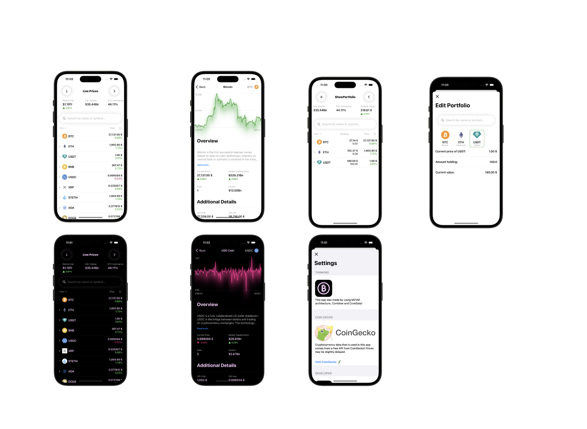

# SwiftUI Crypto Tracker

---

An iOS application written in Swift and designed to manage your cryptocurrency portfolio. With its intuitive interface and cutting-edge features, CryptoTracker offers a seamless experience for tracking and managing your tokens' values. It is built by using MVVM architecture, Combine and CoreData!

## Tech Stack

---

- Swift
- SwiftUI
- Combine
- CoreData

## Features

---

- ✅ Live Token data with CoinGecko API
- ✅ Global market cap details
- ✅ Detailed Token information with comprehensive details and charts
- ✅ Portfolio monitoring to add and track an unlimited number of tokens

## License

---

Released under the MIT License. Feel free to use, modify, and distribute this project according to the terms of the license.